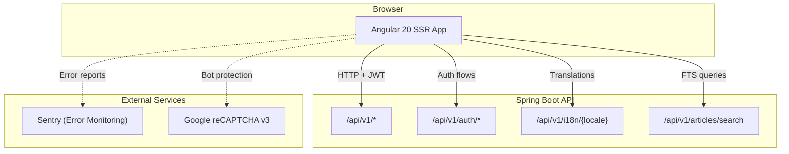
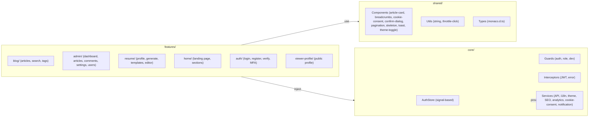
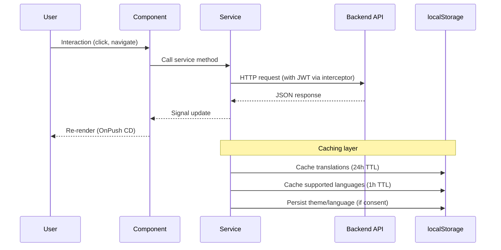
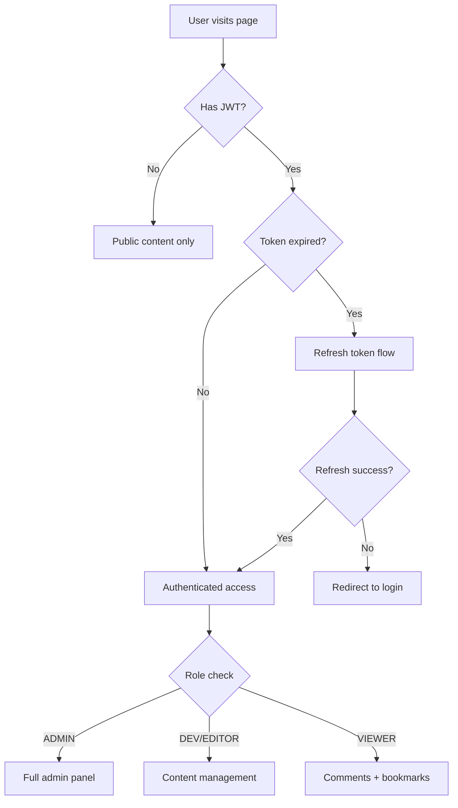
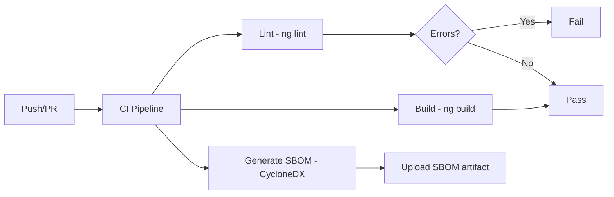

# Frontend Architecture

## High-Level Overview

## Module Architecture

## Data Flow

## Authentication Flow

## Feature Breakdown

### Blog Module
- **Article list** with pagination, tag filtering, search
- **Article detail** with ToC, reading progress, comments (extracted to `ArticleCommentsComponent`), social sharing, related articles
- **Search** with server-side PostgreSQL FTS, cross-language support via `'simple'` config
- **Tags** with tag cloud and per-tag article listing

### Admin Module
- **Dashboard** with analytics summary
- **Article management** with Monaco editor, auto-save, version history, translations, review workflow
- **Comment moderation** with server-side search
- **User management** with role assignment
- **Settings** with import/export (JSON validation + XSS sanitization)
- **Newsletter** management

### Resume Module
- **Profile editor** with sections (experience, education, skills, projects, languages, testimonials)
- **HTML/PDF generation** with language selection
- **Template editor** with Monaco (HTML+CSS), live preview, snippet insertion
- **Template management** (list, create, update, set default)

## Key Patterns

| Pattern | Implementation |
|---------|---------------|
| State management | Signal-based (`signal()`, `computed()`, `effect()`) |
| Change detection | `OnPush` everywhere |
| Auth state | `AuthStore` with signals, no NgRx |
| i18n | DB-driven, English bundled, others fetched + cached |
| Error handling | `GlobalErrorHandler` → Sentry + backend reporting |
| Cookie consent | 3-tier (necessary/functional/analytics) with degradation UX |
| Analytics | First-party only, consent-gated, scroll depth + time-on-page |
| Code editor | Monaco (lazy-loaded via `MonacoLoaderService`) |
| Forms | Reactive (`FormBuilder`) for complex forms, template-driven for simple |
| API calls | `ApiService` wrapper with typed methods + JWT interceptor |

## Build & CI

